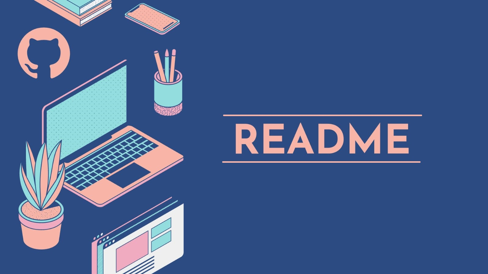

<p align = center>
    
</p>

# DOCUMENTAÇÃO README

[](https://github.com/) [](http://git-scm.com/) [](https://www.figma.com/) [](https://www.javascript.com/)  [](https://www.typescriptlang.org/) [](https://code.visualstudio.com/)

<p align = "justify">Este arquivo constatará um README padronizado.
Você irá ver a utilização de imagens com HTML e markdown.
</p>

<p align = "justify" style = "margin-bottom: 5rem;">Iremos apresentar menu como tabela de conteúdo, tecnologias, badges entre outros.</p>

## Menu

<style>

.limenu{

    display: inline;
    padding: .5rem;

}

.limenu a{

    decoration: none;
    color: #6283f3

}

</style>

<ul style = "margin-bottom: 5rem">
    <li class = "limenu"><a href = "#descricao">Descrição</a></li>
    <li class = "limenu"><a href = "#status">Status</a></li>
    <li class = "limenu"><a href = "#features">Features</a></li>
    <li class = "limenu"><a href = "#mapaprojeto">Mapa do Projeto</a></li>
    <li class = "limenu"><a href = "">Tecnologias</a></li>
</ul>

## :rocket: Status do Projeto
<p id = "status">
    ...Em produção
</p>

<p id = "features"></p>

## Features
- [X] Badges
- [X] Features
- [X] Status
- [ ] Tecnologia


<p id = "mapaprojeto"></p>

## Mapa do Projeto

```.
├───img
└───temp
```


<!-- |header1|header2|
|-----|----|
|itemli1|itemli2| >